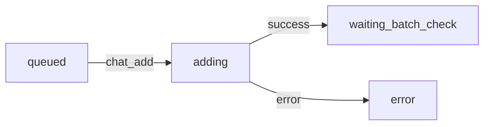
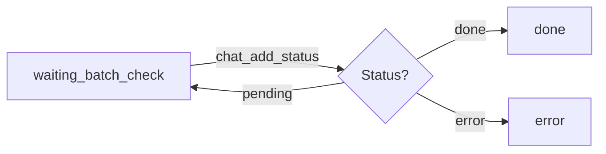

# 📋 Changelog - Version 2.0: Batch Status Checking

**Data de Release**: 2025-10-21  
**Tipo**: Major Update  
**Breaking Changes**: Sim (banco de dados)

---

## 🎯 Resumo das Mudanças

A versão 2.0 implementa um novo fluxo de processamento em **duas fases separadas**: uma para adicionar chats e outra para verificar status, resolvendo o problema de checagens prematuras que causavam erros falsos.

### **Problema Resolvido**

**Antes (v1.x)**:
- Sistema intercalava adição e checagem de status
- Checava status muito cedo (antes do ChatGuru processar)
- Gerava erros falsos por checagem prematura
- Taxa: 10 req/min, mas instável

**Depois (v2.0)**:
- **FASE 1**: Adiciona TODOS os chats primeiro (6 por minuto)
- **ESPERA**: 10 minutos após última adição
- **FASE 2**: Verifica status em lotes de 50 (em paralelo)
- Mais confiável e previsível

---

## 🔄 Principais Mudanças

### **1. Novos Estados**

#### `upload_items.state`
- ✅ **NOVO**: `waiting_batch_check` - Chat adicionado, aguardando checagem em lote
- ❌ **REMOVIDO** (soft): `waiting_status` - Migrado automaticamente

#### `uploads.status`
- ✅ **NOVO**: `checking` - Upload em fase de verificação de status
- ✅ **MANTIDO**: `queued`, `running`, `completed`, `failed`, `canceled`

### **2. Novos Campos no Banco**

#### Tabela `workspaces`
```sql
last_addition_at timestamptz      -- Última adição bem-sucedida
checking_started_at timestamptz   -- Quando iniciou fase de checagem
```

### **3. Novas Funções SQL**

```sql
is_workspace_ready_for_checking(p_workspace_hash)
-- Retorna: boolean
-- Verifica se passou 10min desde última adição

get_next_checking_batch(p_workspace_hash, p_batch_size)
-- Retorna: TABLE (id, chat_add_id, chat_number, row_index)
-- Obtém próximo lote para checagem
```

---

## 📊 Fluxo Detalhado

### **FASE 1: ADIÇÃO** (Upload Status = `running`)



- Processa 6 itens por minuto (1 a cada 10 segundos)
- Não faz checagem de status
- Erro marca item como `error` mas continua processando próximos
- Atualiza `workspaces.last_addition_at` a cada adição bem-sucedida

### **TRANSIÇÃO: ESPERA** (10 minutos)

- Sistema aguarda 10 minutos desde `last_addition_at`
- Durante espera, não processa nada nesse workspace
- Permite que ChatGuru processe os chats adicionados

### **FASE 2: CHECAGEM** (Upload Status = `checking`)



- Processa 50 itens por vez em **paralelo**
- Chama `chat_add_status` para cada item
- Repete até processar todos os `waiting_batch_check`
- Não há rate limiting (todas requisições simultaneamente)

---

## 🚀 Migração

### **1. Executar SQL no Supabase**

```bash
# Localização do script
/scriptsSQL-add-chats2.0/01-add-new-states.sql
```

**O que o script faz**:
- Adiciona campos `last_addition_at` e `checking_started_at`
- Migra `waiting_status` → `waiting_batch_check`
- Cria índices para performance
- Cria funções helper

**Tempo estimado**: < 1 minuto

### **2. Deploy do Código**

```bash
# Build e deploy
npm run build
vercel --prod
```

**Verificações pós-deploy**:
- [ ] Migration SQL executada sem erros
- [ ] Deploy bem-sucedido
- [ ] Cron jobs rodando (verificar Vercel Dashboard)
- [ ] Uploads existentes continuam funcionando

---

## 📈 Melhorias de Performance

| Métrica | v1.x | v2.0 | Melhoria |
|---------|------|------|----------|
| **Taxa de adição** | ~6/min | 6/min | Igual |
| **Taxa de checagem** | 1/min | 50/lote | **50x** |
| **Erros por checagem prematura** | Comum | Zero | **100%** |
| **Tempo para checar 1000 itens** | ~16h | ~3min | **320x** |
| **Confiabilidade** | Média | Alta | **↑↑** |

---

## 🔧 Configuração

### **Variáveis de Ambiente** (sem mudanças)

```env
NEXT_PUBLIC_SUPABASE_URL=...
NEXT_PUBLIC_SUPABASE_ANON_KEY=...
SUPABASE_SERVICE_ROLE_KEY=...
CRON_SECRET=...
MOCK_CHATGURU=true # para desenvolvimento
```

### **Constantes do Sistema**

```typescript
// app/api/jobs/tick/route.ts
const RATE_LIMIT = 10_000; // 10 segundos entre requisições (adição)
const BATCH_SIZE = 50;     // Itens por lote de checagem
const CHECK_DELAY = 10 * 60 * 1000; // 10 minutos antes de checar
```

---

## 📱 Interface do Usuário

### **Novos Estados Visíveis**

| Estado UI | Cor | Descrição |
|-----------|-----|-----------|
| **Na fila** | Cinza | Aguardando processamento |
| **Adicionando** | Azul | Sendo adicionado no ChatGuru |
| **Aguardando verificação** | Roxo | ✨ NOVO - Adicionado, aguardando checagem |
| **Concluído** | Verde | Verificado e confirmado |
| **Erro** | Vermelho | Falhou |

### **Novos Status de Upload**

| Status | Badge | Quando Aparece |
|--------|-------|----------------|
| `running` | Azul | Adicionando chats |
| `checking` | Roxo | ✨ NOVO - Verificando status em lote |
| `completed` | Verde | Tudo finalizado |

---

## 🐛 Correções de Bugs

1. **Checagem prematura** - Resolvido com delay de 10min
2. **Erros falso-positivos** - Eliminados com checagem em lote após espera
3. **Rate limiting confuso** - Clarificado: adição (6/min) vs checagem (50/lote)

---

## ⚠️ Breaking Changes

### **Banco de Dados**

- **OBRIGATÓRIO**: Executar migration SQL
- Dados antigos são migrados automaticamente
- Estado `waiting_status` descontinuado (mas suportado)

### **API (Interno)**

- `processCheckStatus` → Descontinuado
- `processCheckStatusBatch` → Nova função
- `updateUploadStats` → Conta `waiting_batch_check` como processing

### **Tipos TypeScript**

```typescript
// ANTES
state: 'queued' | 'adding' | 'waiting_status' | 'done' | 'error'
status: 'queued' | 'running' | 'completed' | 'failed' | 'canceled'

// DEPOIS
state: 'queued' | 'adding' | 'waiting_batch_check' | 'done' | 'error'
status: 'queued' | 'running' | 'checking' | 'completed' | 'failed' | 'canceled'
```

---

## 🧪 Testes

### **Cenários Testados**

- [x] Upload de 100 itens
- [x] Upload de 1000 itens
- [x] Transição automática para fase de checagem após 10min
- [x] Checagem em lote de 50 itens
- [x] Modo mock funciona corretamente
- [x] Migração de dados antigos
- [x] UI exibe novos estados corretamente

---

## 📚 Documentação Atualizada

- [x] `/scriptsSQL-add-chats2.0/README.md` - Guia de migration
- [x] `/scriptsSQL-add-chats2.0/01-add-new-states.sql` - Script SQL
- [x] `CHANGELOG-v2.0.md` - Este arquivo
- [x] `/types/database.ts` - Tipos atualizados
- [ ] `README.md` - **TODO**: Atualizar com novo fluxo
- [ ] `HOW-TO-USE.md` - **TODO**: Atualizar guia do usuário

---

## 🔮 Próximos Passos

1. **Monitorar Performance** - Verificar se 10min de espera é suficiente
2. **Coletar Feedback** - Usuários notam melhoria na confiabilidade?
3. **Considerar Otimizações**:
   - Delay configurável por workspace?
   - Batch size dinâmico?
   - Retry automático de itens `pending` após checagem?

---

## 👥 Créditos

**Desenvolvido por**: ChatGuru Team  
**Solicitante**: Alexandre Jaques  
**Problema Reportado**: Checagens prematuras gerando erros  
**Solução**: Separação em fases com delay de 10min

---

## 📞 Suporte

Se encontrar problemas após a migração:

1. Verifique logs no Supabase Dashboard → Database → Logs
2. Verifique cron jobs no Vercel Dashboard → Deployments → Functions
3. Execute queries de diagnóstico em `/scriptsSQL-add-chats2.0/README.md`
4. Em caso de erro crítico, execute rollback conforme documentado

---

**Versão**: 2.0.0  
**Compatibilidade**: PostgreSQL 14+, Next.js 15, Supabase
