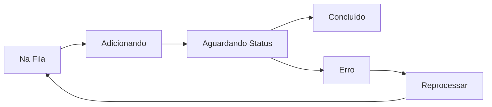

# 📚 ChatGuru Atool - Guia Completo de Uso

## 🎯 O que é o ChatGuru Atool?

O **ChatGuru Atool** é uma ferramenta profissional para importação em massa de contatos para o ChatGuru CRM. Permite adicionar centenas ou milhares de contatos de forma automatizada através de planilhas Excel, respeitando os limites da API e garantindo confiabilidade no processo.

## 🚀 Funcionalidades Principais

### ✨ Recursos Disponíveis

- **📊 Importação via Excel (XLSX)**: Upload de planilhas com múltiplos contatos
- **⏱️ Rate Limiting Automático**: 1 requisição por minuto (proteção contra bloqueios)
- **📈 Progresso em Tempo Real**: Acompanhe o status de cada contato
- **🔄 Reprocessamento de Falhas**: Tente novamente itens que falharam
- **📥 Exportação de Erros**: Baixe relatório detalhado de falhas
- **🔐 Segurança**: Credenciais nunca são armazenadas no banco
- **📉 Limite de 10.000 contatos**: Por Account ID do ChatGuru
- **🧹 Limpeza Automática**: Dados deletados após 45 dias

## 📋 Pré-requisitos

Para usar o sistema, você precisa ter:

1. **Credenciais do ChatGuru**:
   - **Servidor** (ex: s10, s20, etc.)
   - **API Key** (chave de API)
   - **Account ID** (identificador da conta)
   - **Phone ID** (identificador do telefone)

2. **Planilha Excel** no formato correto (veja seção Template)

## 🔧 Como Usar - Passo a Passo

### Passo 1: Acessar o Sistema

1. Abra o navegador e acesse a URL da ferramenta
2. Você verá a tela inicial "Add/Import Chats"

### Passo 2: Configurar Credenciais

1. **Preencha os campos**:
   - **Servidor**: Digite apenas o número (ex: `s10`)
   - **API Key**: Cole sua chave de API completa
   - **Account ID**: Cole o ID da sua conta
   - **Phone ID**: Cole o ID do telefone

2. **Marque "Lembrar neste navegador"** se quiser salvar as credenciais localmente

3. **Clique em "Checar credencial"** ⚠️ IMPORTANTE!

### Passo 3: Verificação de Credenciais

Ao clicar em "Checar credencial", o sistema irá:

1. **Validar suas credenciais** com o ChatGuru
2. **Verificar seu uso atual** (quantos contatos já foram adicionados)
3. **Mostrar o limite disponível** (máximo 10.000 por Account ID)

#### 🟢 Credenciais Válidas
- Mensagem: "Credenciais válidas" em verde
- Mostra barra de progresso com uso atual
- Libera botão de upload

#### 🔴 Credenciais Inválidas
Possíveis mensagens de erro:
- "Credenciais inválidas. Verifique sua API Key e IDs"
- "Servidor s20 não encontrado. Verifique o nome do servidor"
- "Erro ao conectar com ChatGuru. Verifique sua conexão"

### Passo 4: Verificar Limite de Uso

Após validar as credenciais, você verá:

```
Uso do Account ID
2.543 / 10.000                    25.4% usado
[████████░░░░░░░░░░░░░░░░░░░░░░]
7.457 contatos restantes
```

#### ⚠️ Alertas de Limite:

- **< 75% usado**: Barra verde, uso normal
- **75-90% usado**: Barra amarela, atenção ao limite
- **> 90% usado**: Barra vermelha + alerta "Próximo do limite"
- **100% usado**: Upload bloqueado completamente

### Passo 5: Preparar Planilha

#### Baixar Template

1. Clique em **"Baixar Template XLSX"**
2. Abra o arquivo `add-chats-template.xlsx`

#### Estrutura da Planilha

| Coluna | Obrigatório | Descrição | Exemplo |
|--------|------------|-----------|---------|
| **chat_number** | ✅ Sim | Número completo com DDI | 5511999887766 |
| **name** | ✅ Sim | Nome do contato | João Silva |
| **text** | ❌ Não | Primeira mensagem | Olá, tudo bem? |
| **user_id** | ❌ Não | ID do usuário responsável | user123 |
| **dialog_id** | ❌ Não | ID do diálogo para vincular | dlg456 |

#### ⚠️ Regras Importantes:

1. **Números**: Sempre com DDI, sem espaços ou caracteres especiais
2. **Nome**: Campo obrigatório, mínimo 2 caracteres
3. **Texto vazio**: Sistema envia um espaço automaticamente
4. **Máximo**: 10MB por arquivo
5. **Formato**: Apenas .xlsx (Excel)

### Passo 6: Fazer Upload

1. **Clique em "Upload XLSX"**
2. Selecione sua planilha preenchida
3. Aguarde a validação

#### ✅ Upload Bem-sucedido
- Redirecionamento automático para tela de acompanhamento
- Processamento inicia automaticamente

#### ❌ Possíveis Erros de Upload

| Erro | Solução |
|------|---------|
| "Por favor, valide suas credenciais primeiro" | Clique em "Checar credencial" antes |
| "Você já tem um processamento em andamento" | Aguarde o processamento atual terminar |
| "Limite de 10.000 contatos atingido" | Account ID chegou ao limite máximo |
| "Por favor, envie apenas arquivos Excel (.xlsx)" | Use o formato correto |
| "O arquivo é muito grande. Tamanho máximo: 10MB" | Divida em arquivos menores |
| "Colunas obrigatórias ausentes" | Verifique chat_number e name |
| "Nenhuma linha válida encontrada" | Adicione dados além do cabeçalho |

### Passo 7: Acompanhar Processamento

Na tela de detalhes você verá:

#### 📊 Barra de Progresso
```
Progresso
[████████████░░░░░░░░░░░░░░░░░░] 40%
40 de 100 processados
```

#### 📋 Tabela de Itens

| Status | Significado | Cor |
|--------|------------|-----|
| **Na fila** | Aguardando processamento | Cinza |
| **Adicionando** | Sendo processado agora | Azul |
| **Aguardando** | Verificando se foi criado | Amarelo |
| **Concluído** | Adicionado com sucesso | Verde |
| **Erro** | Falha na adição | Vermelho |

#### ⏱️ Taxa de Processamento
- **1 contato por minuto** por workspace
- **~10 contatos a cada 10 minutos**
- **100 contatos**: ~1h40min
- **1000 contatos**: ~16h40min

### Passo 8: Gerenciar Falhas

#### Reprocessar Itens com Erro

1. Na tela de detalhes, clique em **"Reprocessar Falhas"**
2. Itens com erro voltam para a fila
3. Sistema tenta novamente automaticamente

#### Baixar Relatório de Falhas

1. Clique em **"Baixar Falhas XLSX"**
2. Abra o arquivo para ver:
   - Número que falhou
   - Nome do contato
   - Código do erro
   - Mensagem de erro detalhada

## 🔄 Processamento Automático

### Como Funciona?

1. **Upload**: Arquivo é validado e itens entram na fila
2. **Fila**: Sistema processa 1 item por minuto
3. **Adição**: Envia requisição para criar chat no ChatGuru
4. **Verificação**: Confirma se chat foi criado com sucesso
5. **Conclusão**: Marca como concluído ou erro

### Estados do Processamento



## 📊 Jobs Recentes

Na página inicial, após validar credenciais, você vê:

| Arquivo | Status | Progresso | Criado em | Ações |
|---------|--------|-----------|-----------|-------|
| lista-jan.xlsx | Processando | 45/100 | 27/01, 14:30 | Ver |
| contatos.xlsx | Concluído | 250/250 | 26/01, 10:15 | Ver |
| novos.xlsx | Na fila | 0/50 | 27/01, 15:45 | Ver |

### Status dos Jobs

- **Na fila**: Aguardando início
- **Processando**: Em andamento
- **Concluído**: Finalizado
- **Falhou**: Teve erros (verifique detalhes)

## ⚠️ Limitações e Regras

### Limite de 10.000 Contatos

- **Por Account ID**: Não por usuário ou workspace
- **Permanente**: Não reseta mensalmente
- **Compartilhado**: Todos usando mesmo Account ID compartilham o limite
- **Bloqueio automático**: Sistema impede uploads após 10.000

### Rate Limiting

- **1 requisição/minuto**: Por conjunto de credenciais
- **Automático**: Sistema gerencia a fila
- **Sem configuração**: Taxa fixa, não alterável

### Retenção de Dados

- **45 dias**: Dados são automaticamente deletados
- **Sem backup**: Exporte relatórios antes de 45 dias
- **Limpeza diária**: Executa às 3h da manhã

## 🛠️ Solução de Problemas

### Erro: "Sessão expirada"
**Solução**: Volte para página inicial e valide credenciais novamente

### Erro: "Workspace não encontrado"
**Solução**: Suas credenciais expiraram, faça "Checar credencial" novamente

### Upload travado em "Processando"
**Causas possíveis**:
1. Sistema está respeitando rate limit (normal)
2. Verifique se há erros nos itens
3. Aguarde ou recarregue a página

### Contatos não aparecem no ChatGuru
**Verificar**:
1. Status está "Concluído" no sistema?
2. Número está no formato correto?
3. ChatGuru pode ter rejeitado (verifique código de erro)

## 💡 Dicas e Boas Práticas

### ✅ Recomendado

1. **Valide sempre** as credenciais antes de fazer upload
2. **Use o template** como base para suas planilhas
3. **Divida arquivos grandes** em lotes de 500-1000 contatos
4. **Monitore o progresso** regularmente
5. **Exporte falhas** para análise e correção
6. **Verifique o limite** antes de grandes importações

### ❌ Evitar

1. **Não** feche a aba durante processamento (não para o processo)
2. **Não** faça múltiplos uploads simultâneos com mesmas credenciais
3. **Não** use números inválidos ou de teste em produção
4. **Não** ignore mensagens de erro
5. **Não** tente burlar o rate limit

## 📞 Suporte

### Problemas Comuns

| Problema | Primeira Ação |
|----------|---------------|
| Credenciais não funcionam | Verifique no painel do ChatGuru |
| Upload falha | Verifique formato da planilha |
| Processamento lento | Normal - 1/minuto é o limite |
| Limite atingido | Entre em contato com ChatGuru |

### Informações Técnicas

- **Rate Limit**: 60 segundos entre requisições
- **Timeout**: 2 minutos por requisição
- **Tamanho máximo**: 10MB por arquivo
- **Formatos aceitos**: Apenas .xlsx
- **Navegadores**: Chrome, Firefox, Safari, Edge

## 🔒 Segurança e Privacidade

### Suas Credenciais

- ✅ Armazenadas apenas no seu navegador (localStorage)
- ✅ Nunca salvas no banco de dados
- ✅ Criptografadas em trânsito (HTTPS)
- ✅ Workspace isolado por hash único

### Seus Dados

- ✅ Deletados automaticamente após 45 dias
- ✅ Isolados por workspace
- ✅ Sem acesso cruzado entre contas
- ✅ Backup é sua responsabilidade

## 📱 Interface do Usuário

### Página Principal
- Formulário de credenciais
- Botão "Checar credencial"
- Indicador de uso (barra de progresso)
- Lista de jobs recentes
- Botões de ação (Download Template, Upload)

### Página de Detalhes
- Progresso geral com porcentagem
- Estatísticas (processados, sucesso, erro)
- Tabela com todos os itens
- Status individual de cada contato
- Botões de ação (Reprocessar, Baixar Falhas)

### Indicadores Visuais
- 🟢 Verde: Sucesso/Válido
- 🔵 Azul: Processando
- 🟡 Amarelo: Atenção/Aguardando
- 🔴 Vermelho: Erro/Limite
- ⚫ Cinza: Na fila/Inativo

## 🎯 Casos de Uso

### Importação de Leads
1. Exporte leads do seu CRM/planilha
2. Formate segundo o template
3. Faça upload e acompanhe
4. Leads aparecem no ChatGuru

### Migração de Base
1. Exporte contatos antigos
2. Divida em lotes de 1000
3. Processe um lote por vez
4. Monitore e corrija falhas

### Campanhas de Marketing
1. Lista de novos prospects
2. Adicione mensagem personalizada
3. Configure user_id do vendedor
4. Importe e inicie abordagem

---

## 📝 Notas Finais

O ChatGuru Atool foi desenvolvido para facilitar importações em massa respeitando os limites e boas práticas da API do ChatGuru. Use com responsabilidade e sempre de acordo com as políticas de uso do ChatGuru e LGPD.

**Versão**: 1.0.0  
**Última atualização**: Janeiro 2024  
**Desenvolvido por**: ChatGuru Team

---

💡 **Dúvida não respondida?** Verifique o README.md para informações técnicas ou entre em contato com o suporte.